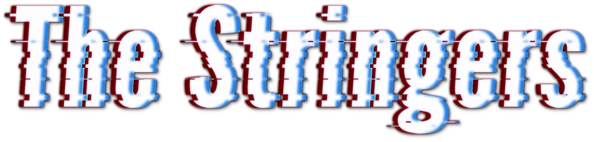

<h1> Butterfly Effect</h1>

<h3>Table of contents</h3>
<ul>
    <li>Team</li>
    <li>Description of the Project</li>
    <li>Code</li>
</ul>

<h2>Team</h2>

Живко Нанев – Scrum Trainer

Живко в ролята си на Scrum Trainer, беше отговорен за мотивацията, повдигнатото настроение на отбора, както и безпрепядственото общуване между участниците. Сплотяваше ни, но освен това, допринесе цялостно за миналата ни идея която се провали заради липса на време.

Даниел Георгиев – Backend Developer.

Даниел в ролята си на Backend Developer е писал  кода за играта,  беше голяма  част от създаването на историята на предишната ни идея за играта Butterfly Effect и изработи логото на отбора и играта.

Добрин Пейчев – Frontend Developer.

Добрин в ролята си на Frontend Developer помагаше със създаването на презентацията, създаде голяма част от историята на предишната ни идея за проект и беше против идеята за създаването на бесеницата.

Йоан Танев – Code Checker.

Йоан Танев направи документацията и част от презентацията. Също така даваше идеи как да продължи историята на играта Butterfly Effect.

<h2>Description of the Project</h2>

Our game is named “Butterfly effect”. Its genre is text adventure horror. The player uses text input to control the game, and the game state is relayed to the player via text output. Basically you have to make decisions which can change the future dramatically. 

Our new project is named “Hangman” Basically hangman is a paper and pencil guessing game for two or more players. One player thinks of a word, phrase or sentence and the other(s) tries to guess it by suggesting letters within a certain number of guesses.

<h2>Code</h2>

